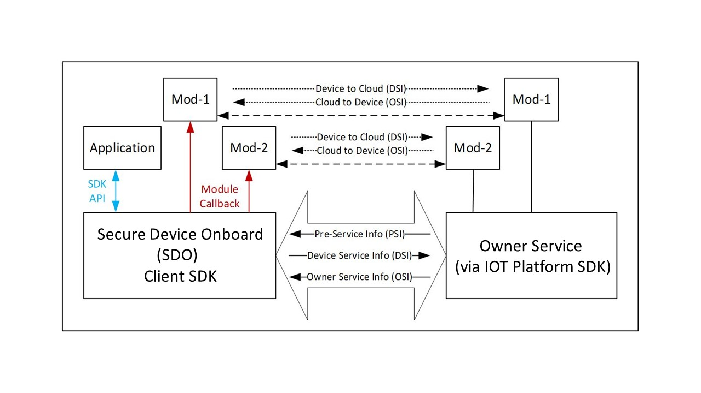

## Introduction
The Secure Device Onboard Client SDK is a portable implementation of the Secure Device Onboard (SDO) protocol state machines, cryptographic operations, and associated components. While the Client SDK was developed and tested on the Linux* OS, the core components of the SDK are isolated from OS-specific components via an abstraction layer. Well-known open-source implementations of cryptographic libraries are used for cryptographic operations.

In addition, the Client SDK is ported to the following Arm* platforms: 

1.	Nucleo* development board (NUCLEO-F429ZI) running STM32F429ZI ARM Cortex*-M4 MCU over Mbed* OS.  
2.	NUCLEO-F767ZI development board running STM32F767ZI Arm* Cortex*-M7 MCU over Mbed* OS.  
3.	WaRP7 development board running i.MX 7 series Arm Cortex-A7 MPU over Mbed Linux.  

The Client SDK is a reference implementation that can be used to onboard a device and then give control to the device application or IOT Platform Service. “Onboarding” means the process by which a device establishes its first trusted connection with an IOT Platform Service.  

Linux provides an easy-to-use development environment for SDK development, debug, and validation. When the SDK is ported to a particular environment, the abstraction layer will be ported to the target environment and real-time operating system (RTOS) (or bare metal). If the target environment supports hardware-accelerated cryptography, the cryptography interfaces will also be ported. If the target environment does not support cryptographic acceleration, the software cryptography libraries used by the SDK will need to be ported. The core SDK can be recompiled in the target environment with no change.

!!! note
	The hardware abstraction layer (HAL) implementation provided in this release is for reference only and not intended for production. It does not provide the level of security required by industry standards for a fully secure production environment.

### Terminology

Refer to the [Secure Device Onboard Reference page](../reference.md).

### Reference Documents

Refer to the [Secure Device Onboard Reference page](../reference.md).

## Client SDK Overview
Like any SDK, the Client SDK is expected to be embedded within a custom implementation that provides overall device functionality while using the SDK to perform SDO-based device onboarding. The SDK will be statically linked to an application that invokes SDK APIs to trigger onboarding functionality. This implementation is referred to as the ‘Application’ in this document.

Figure 1.	SDO Client Block Diagram


!!! note
    SDO is an acronym for Secure Device Onboard.  

Before initiating the Secure Device Onboard functionality, the Application must first initialize the SDK. After initializing the SDK, the Application can initiate the onboarding by calling the `sdo_sdk_run()`API.
The SDK maintains persistent data such as configuration and state information that are used to track the onboarding state and store credentials, among others. This information is stored in the **SDK Configuration** file that persists across reboots.

### Threading Model
The SDO Client SDK is single threaded and the APIs are non-reentrant and blocking. SDK code executes in the context of the calling application thread and will make OS calls via the abstraction layer for storage and networking services within the context of this thread. OS service such as storage and network are assumed to be blocking.

During the execution of the onboarding protocol, the SDK receives data from the Owner Server that must be passed back to application modules (Pre-Service & Owner Service Information).This is achieved via module-specific callback functions that are registered during the SDK initialization.

These callback functions are also called within the context of the application thread that entered the SDK via one of the SDK’s APIs (*`sdo_sdk_run`*). The application must not invoke an SDK API from within the callback – SDK flows have been designed such that this is not required.

In addition to module specific callbacks, the SDK requires an additional callback that is used to inform the Application of events occurring during long-running activities, such as network connection retries, as well as errors, such as network connection drop.

### Networking
It is assumed that the machine on which the SDK runs has access to the network. The SDK uses standard POSIX sockets interface to connect to external back-end Rendezvous and Owner Servers. The SDK uses the OpenSSL* toolkit for SSL support.

The SDK will initiate connections to the following external ports, which must not be blocked by a firewall:

-	8039: The SDK connects to the SDO Manufacturer Server on this port.
-	8040: The SDK connects to the SDO Rendezvous Server on this port.
-	8042: The SDK connects to the SDO Owner Server on this port.

For details on the Manufacturer Server, Rendezvous Server, and Owner Server refer to the Reference Documents.

### Device-Specific Modules
SDO is a generic mechanism of establishing trust between a device and the final owner’s cloud-based IOT Platform Service (known as the Owner Service). Once this trust is established, the Owner Service must perform the following actions:

1.	Setup the device for final operation. This requires configuration of device specific operational parameters. This is determined by the device being onboarded, for example, it is device specific.
2.	Full integration into the organization’s IOT Platform Service. This is specific to the IOT Platform Service being used.

Since SDO cannot define these steps for all devices and IOT Platforms, it provides a flexible method to allow these operations to be carried out in a secure manner using Modules.

Modules are defined by the device manufacturer (ODM) and are pieces of code that have a specific name and perform a specific function. Firmware update, key provisioning, and Wi-Fi* network setup are some examples of common functionality that could be provided by modules.

A module must be able to report information [called the ***Device Service Information (DSI)***], to IOT Platform, and accept configuration information [called the ***Owner Service Information (OSI)***], from the Owner Service. A module must also be able to publish details of what information it will report as DSI and what information it will accept as OSI. This is done in the form of key-value pairs. The key identifies a parameter and the value provides the value of the parameter.

A module will publish its interface in the form of DSI keys with associated valid values and OSI keys with associated valid values. The Owner Service is expected to be aware of all devices it will onboard and associated DSI and OSI interfaces.

!!! note
	The expectation is that over time, much like reusable libraries, modules providing specific functionality such as firmware updates or key provisioning will become standardized in terms of their capabilities and interfaces. Device manufactures will simply port the modules and include these libraries to their device implementation. A similar development is expected to occur on the Owner Server side where standard libraries will be developed to interact with the device module and included in the Owner Server implementation.

When a device is onboarded, a secure channel is established between the device and Owner Server after the device has authenticated the Owner Server and vice-versa (during the TO2 protocol). At this point, the Owner Server can query information from the device (DSI) and send down configuration information to the device (OSI). The secure channel uses encryption and integrity protection to secure DSI/OSI data in transit from/to the device.

In addition to DSI and OSI, SDO defines ***Pre-Service Info*** or ***PSI***, a mechanism that the Owner Server can use to inform the device of its expectations in terms of module support. This precedes DSI and OSI and contains a list of expected modules along with basic capabilities expected of the module.
The following section details the interactions between the Application, Client SDK and Device-specific Modules.

### Integrated Operational Flows
This SDK release requires all software components to be linked together into a single binary image and execute at the same privilege level. While some systems might include overlays and Trusted Execution Environments, these are not considered for this version.

Figure 2.	Integrated Image and Execution Flow


The integrated image and execution flows from system boot are shown above and each step is described below:

1.	On reset, the Board Support Package (BSP) and RTOS initialize the hardware and pass the control to the Application. On Linux* systems, this is the normal OS boot flow and is complete by the time the Application executes.

2.	The Application initializes all SDO modules if required. The Application also initializes the SDK by calling the `sdo_sdk_init()` API and registers each module with the SDK by passing the module’s name and callback address to the SDK (in the `sdo_sdk_service_info_module` structure).
3.	The Application checks if SDO onboarding has been completed by calling the `sdo_sdk_get_status()` API. If the status `SDO_SDK_STATE_IDLE` is returned, onboarding has been completed and the Application goes to step 6. If not, the Application goes to step 4.
4.	The Application initiates SDO onboarding by calling the `sdo_sdk_run()` API. This call returns either a successful completion of onboarding or an error. If an error occurs, the Application will reset the device and retry the sequence, with some delay. On successful completion of onboarding, the Application goes to step 6.
5.	During the onboarding process, the SDK will call registered modules during the Service Info stage of the protocol. This is done by calling the registered module callback. Details of this interaction are provided in the Figure 3. The onboarding process will succeed only if all module interactions at this stage are successful.
6.	The Application has successfully completed onboarding and continues normal operation of the device.

The Application continues operating until the system is powered off or reset. On System restart, the preceding steps are re-executed. 

### SDO Module Flows
As mentioned in [Device Specific Modules section](#device-specific-modules), three types of information exchange occur between each module and the Owner Service:  

1.	Pre-Service Info (PSI)
2.	Device Service Info (DSI)
3.	Owner Service Info (OSI)

Each of these is described as follows: 

Figure 3.	Service Info Exchanges between Device and Owner Server



As shown in the diagram, PSI is ‘global’ to all modules and occurs once between the device and Owner Server. DSI and OSI are module specific.

#### Module Initialization
For each registered module, the SDK initializes the module by call its callback with the `SDO_SI_START` type. The module is expected to prepare to receive PSI, DSI, and OSI calls after initialization.

If an error occurs after a module has been initialized, during the remainder of TO2 protocol execution and the Application is restarted, the SDK will again call this API to initialize each registered module. The module must be prepared for multiple such calls due to the SDK’s retry-based approach to error recovery.

#### Pre-Service Info (PSI)
The intent of PSI is described in the SDO Protocol specification. Basically, PSI provides the Owner Server with a way to inform a module what to expect during the next two service info sequences (such as, DSI and OSI). The module should use this information to prepare itself for the subsequent exchanges.

PSI is an ASCII string containing one or more 2-tuple of the format 
`[module-name][module-data]`. The SDK parses the PSI string and locates the module specified by module-name. If this module is not found, the SDK ignores it and continues with the next PSI tuple in the string.

The `[module-data]` is a key-value pair where the value is optional (depending on the key) and is encoded as `key~value` (the ‘~’ char is the delimiter). The SDK will parse this substring to extract the key and value.

If the module is found, the SDK invokes the modules callback function with type `SDO_SI_SET_PSI` and passes the module-data to it in the sv parameter. The key is contained in `sv.key` and the value if present, is in `sv.value`. If no value is present, the `sv.value` will be `NULL`. The module is expected to process the key-value and return either success or failure. A failure response will cause the entire onboarding sequence to fail and the Application must retry it later. In most cases the Owner Server will use PSI to allow the module to perform basic initialization and setup for the following DSI and OSI rounds in terms of allocating resources, and others.

From a format standpoint, both key and value are `NULL` terminated ASCII strings. The value may optionally contain base64 encoded binary data. A PSI string could contain multiple 2-tuples with the same module-name. In this case, the SDK will invoke the same module multiple times, once for each occurrence of module-name in the PSI string. The corresponding key-value pairs will be passed in each of these invocations. The `count` parameter will act as an ‘index’ starting at 0 for the first invocation and incremented for subsequent invocations.

!!! note
	The PSI is considered the module configuration data and is independent of the DSI (see next section), which is the device information. The number of PSI elements is hence decoupled from the number of DSI elements. If the module wishes to retain either the key of value parameters for later use, it must make a local copy of the contents. The pointers passed during the invocation will be invalid after the callback returns to the SDK.

!!! note
	PSI is one-way, from the Owner Server to the device. Apart from reporting success or failure, the device has no way of communicating any other information back to the Owner Server during this exchange.

#### Device Service Info (DSI)
DSI follows PSI. The module needs to determine in advance how many DSI key-value pairs it needs to send to the Owner Service. In some cases, this is determined statically while in others, the module uses information obtained from the Owner Server in PSI to determine how many DSI key-values it needs to upload.

On completing the PSI round, the SDK queries each registered module for the number of DSI rounds it requires. This is done by invoking the modules callback with the `SDO_SI_GET_DSI_COUNT` type. The module is expected to return the number of DSI key-value pairs it requires in the `count` callback parameter.

When the DSI round for a module begins, the SDK will call the modules callback with the `SDO_SI_GET_DSI` type. The *`count`* parameter will indicate the ‘index’ of the DSI key-value pair being requested by the SDK. The SDK uploads each key-value pair to the Owner Server in the same order. The module may choose to ignore the ‘index’ sent by the SDK, but it is advisable for the module to return key-value data based on this index. This callback will be invoked as many times as specified by the module by the prior `SDO_SI_GET_DSI_COUNT` return value (the ‘index’ value will vary from 0 to `count-1`).

Key-values are returned in the `sv.key` and `sv.value` parameter fields. The `sv.key` must strictly be an `NULL` terminated ASCII string. The `sv.value` is also a `NULL` terminated ASCII string but could also be a Base64 encoded binary value. It is assumed that the Owner Server knows how to interpret a particular key-value from a module. The module must include Base64 encoding capabilities if required.

The very first key-value returned by a module (‘index’ zero) must be an activation value indicating whether the module is active or not. The key value must be `“active”`, and the value must be `“1”` if the module is active or `“0”` if the module is not active. If the module is not active, the Owner Server will not send and DSI messages to the module. This requires each module to have at least one DSI – that is, the count value returned for the `SDO_SI_GET_DSI_COUNT` callback type must be at least `1.` See the SDO Protocol Specification for more information on module activation and deactivation.

Note that DSI is one way – from device to Owner Server. The Owner Server cannot respond to any DSI message during this phase. It can however respond to a prior DSI message in the next, OSI phase.

#### Owner Service Info (OSI)
OSI follows DSI. Unlike DSI, neither the SDK nor the module can determine in advance how many OSI key-values they are going to receive. On receiving an OSI, the SDK locates the module and invokes its callback with the `SDO_SI_SET_OSI` type.

Received key-values are passed to the module in the `sv.key` and `sv.value` callback parameter fields. The `sv.key` must strictly be an `NULL` terminated ASCII string. The `sv.value` is also a NULL terminated ASCII string but could also be a Base64 encoded binary value. It is assumed that the module knows how to interpret the value for a particular key based on the key name. In addition to the sv parameter, the SDK will pass an ‘index’ of the OSI in the `count` parameter. The ‘index’ begins at 0 and increments for each OSI key-value pair received for the module.

Corresponding to the activation message in DSI, the Owner Server could send a deactivation message to a module if it is not planning to use the module. The message will have a key of `“active”` and value of `“0”`. On receiving this message, a module may free allocated resources and effectively shutdown from an SDO perspective. Unlike the activation message, this message is optional and will only be sent if the Owner Server is not going to use the module. A module must expect to remain active unless it explicitly receives a deactivation message, or it already indicated that is not active in the earlier DSI stage. See the SDO Protocol Specification for more information on module activation and deactivation.

If a module receives an OSI when it is in the deactivated state, it should return a status of `SDO SI_CONTENT_ERROR` indicating that the received element was not expected.
The module is expected to process the key-value pair and return a result indicating if the operation was successful or failed. The module may return `SDO_SI_CONTENT_ERROR` or `SDO_SI_INTERNAL_ERROR` to differentiate between invalid value contents or a module run-time error. This information is reported to the Owner Server. The module must return `SDO_SI_SUCCESS` on successful completion.

Note that OSI is one way – from Owner Server to the device. Apart from indicating failure, the device cannot respond to an OSI message.

#### Module Completion
When all service information rounds of all modules have completed successfully, the SDK calls each module’s callback with the `SDO_SI_END` type. All other callback parameters are `NULL`. Modules can commit configuration information at this point if not already done so.

The SDK will not call into the module after this. The SDK will ignore the return value of this callback since no further failure is expected at this point.

#### Module Errors
If an error occurs during the service information phase, the TO2 protocol is considered to have failed and will be aborted. The Application will need to retry onboarding later. A failure could occur for multiple reasons including failure of device/server interaction, failure of signature or hash verification, malformed messages and if a module returns a failure while processing a PSI, DSI, or OSI command/request.

On failure, all modules must clean up internal state and discard any configuration information they might have got from the Owner Server. Conversely, the Owner Server will also discard all data it might have received from modules.

When all service information rounds of all modules have completed successfully, the SDK calls each module’s callback with the `SDO_SI_FAILURE` type. All other callback parameters are `NULL`. Modules must discard all information received via PSI or OSI commands until this point. If operations have been performed, or data already committed, they should be undone to return the system to a pre-service information state.

The SDK will not call into the module after this. The SDK will ignore the return value of this callback since no further failure is expected at this point.

## Run the Client SDK
The Client SDK includes a binary package, intended to get you started quickly and a source package. For details on downloading the packages, refer to the Get Started Guide. 
### Prerequisites
The requirements for the computer that you will run Client SDK on are as follows: 

Table 1.	Prerequisites

|                                                  |                                                                                                                                                                                                                                                                                                                                                                                                                                                                                                                                                                                                                                                                                                                                                                                                                                                 |
|--------------------------------------------------|-------------------------------------------------------------------------------------------------------------------------------------------------------------------------------------------------------------------------------------------------------------------------------------------------------------------------------------------------------------------------------------------------------------------------------------------------------------------------------------------------------------------------------------------------------------------------------------------------------------------------------------------------------------------------------------------------------------------------------------------------------------------------------------------------------------------------------------------------|
|    Software                                      |    ·      Linux\* Ubuntu\* 18.04 using   OpenSSL\* 1.1.1g <br/>·      JDK11  <br/> ·      SDO release binaries package (for running test servers) <br/>     o The root directory of extracted binary package is referred to as <sdo_sdk_binaries> in subsequent sections. <br/>   ·      SDO Client SDK alpha-release binary package <br/>   o The root directory of extracted binary package is referred to as < SDOClientSDK> in subsequent sections. <br/>  ·      SDO Client SDK alpha-release sources package <br/>  o The root directory of extracted source code is referred to as < SDOClientSDK> in subsequent sections. <br/>  ·      Apache Maven\* (for building sample Java\* based test owner   service)   <br/>    Additional Ubuntu\* 18.04  prerequisites can be found in the   <releases source>/SDOClientSDK/README.md     |
|    Safestring   library                          |    Safestring library v1.0.0  <br/> ·          Download safestringlib from  https://github.com/intel/safestringlib  <br/> ·          `cd safestringlib` <br/>   ·          `mkdir obj` <br/>  ·          `make ` <br/>  ·          The   library file libsafestring.a will be created after make.                                                                                                                                                                                                                                                                                                                                                                                                                                                                                                                                                                                |
|    Java\*                                         |    Set the $JAVA_HOME environment   variable.                                                                                                                                                                                                                                                                                                                                                                                                                                                                                                                                                                                                                                                                                                                                                                                                   |123456

### Run the Binary Package
The following subsections provide the steps to run the binary package.

#### Get the Device Private Key (ECDSA based)
The SDK requires a device Private Key as input for device attestation process (to prove itself to Rendezvous or Owner Server during TO1 or TO2 protocol). The key could be based on ECDSA (on curve P-256/P-384) based on the device attestation method being used on the field. This key must be stored in a specific file and is read by the SDK on startup. 

_**For ECDSA (P-256) based device-attestation method:**_  

In case of ECDSA, place the ECDSA P-256 private Key with the name ecdsa256privkey.dat in the following location:
`data/ecdsa256privkey.dat`

_**For ECDSA (P-384) based device-attestation method:**_  

For ECDSA384, place the ECDSA P-384 private Key with the name ecdsa384privkey.dat in the following
location: `data/ecdsa384privkey.data`

Follow [All-in-one Demo README](https://github.com/secure-device-onboard/all-in-one-demo/blob/master/README.md) to start the SDO Manufacturer, Rendezvous, and Owner Service: PRI Owner Service and PRI Rendezvous Service.

    To run SDO ARM Cortex-M4 or Cortex-A7 based devices, follow the detailed steps (including flashing and device preparation) mentioned in the [README](https://github.com/secure-device-onboard/client-sdk/blob/master/README.md) document.

_**Terminal #1: Start All-in-one Demo**_  

#### Device Initialization
This section describes about running the SDO reference device (based on Linux* reference implementation) only. 
Going forward, <sdo-client-sdk-bindir> refers to the location where the SDO Client application 'linux-client' and the related 'data' folder are placed.

!!! note:- </b>
    Running the device for the first time completes DI.
	Running the device for the second time on boards the device. Between subsequent device runs, it is assumed that ownership voucher is correctly extended and TO0 is successfully completed.

_**Terminal 2: Run the device for device initialization:**_  
  
    $ cd <sdo-client-sdk-bindir>
    $ ./linux-client

```    
$ ./linux-client
--------DI successful--------
```
This step completes Device Initialization. 

#### Device Onboarding  
  
_**Run the device again to onboard the device:**_ 

	$ cd <sdo-client-sdk-bindir>
	$ ./linux-client

```
$ ./linux-client
--------TO2 successful--------
@@@@@@@@@@@@@@@@@@@@@@@@@@@@@@@@@@@
@Secure Device Onboarding Complete@
@@@@@@@@@@@@@@@@@@@@@@@@@@@@@@@@@@@
```
This step successfully onboards the device. 

!!! note
    To run SDO ARM Cortex-M4 or Cortex-A7 based devices, follow the detailed steps (including flashing and device preparation) mentioned in the [README](https://github.com/secure-device-onboard/client-sdk/blob/master/README.md) document.

### Build the Source 
Follow these steps to build the source package:  

1.	Make sure you have completed the pre-requisites. Download source code from [Github repository](https://github.com/secure-device-onboard/client-sdk).
2.	Follow the instructions provided in the [README](https://github.com/secure-device-onboard/client-sdk/blob/master/README.md) to build the source code by setting the necessary environment variables.
3.	The SDO Client binary is generated in build/ folder. Ensure to copy them to the root folder before proceeding with the next steps.
4.	Run the SCT, IOT platform SDK and RV servers.
5.	Complete Device Initialization 
6.	Complete Device Onboarding

## Custom Pluggable Modules
As part of the onboard protocol, the Client SDK supports custom pluggable modules. OEMs can develop their desired functionality by following the module protocol. This module functionality will be called during the onboard protocol. 

A sample device module, **sdo_sys** has been developed and is available for reference.

**sdo_sys** device module is intended to collect the data (typically files and scripts) sent from the SDO Owner to the SDO device, process, and execute the data in some meaningful way.

To use **sdo_sys** device module, follow these steps:

**To use the sample device module sdo_sys :**  

1.	Build Client SDK either in release or debug mode using MODULES=true flag.

```
$ cd client-sdk/
$ cmake -DMODULES=true .
$ make -j(nproc)
```

The binary would be created either in build/linux/debug or build/linux/release folder. Copy them to the root folder before proceeding with the next steps.

2.	Run the SDO Linux* device for Device Initialization (DI) protocol:

```
$ ./linux-client
--------DI successful--------
```

3.	Run the SDO Linux* device for Transfer of Ownership (TO1/TO2) protocol (it is assumed that ownership voucher is correctly extended and TO0 is successfully completed prior to this step):

```
$ ./linux-client

--------TO2 successful--------
@@@@@@@@@@@@@@@@@@@@@@@@@@@@@@@@@@@
@Secure Device Onboarding Complete@
@@@@@@@@@@@@@@@@@@@@@@@@@@@@@@@@@@@
```
## Known Issues and Limitations
The following are the known issues:  

•	The HAL implementation provided in this release is for reference only and not intended for production. It does not provide the level of security required by industry standards for a fully secure production environment.

•	‘sdo_sys’ module source within 'device_modules' folder is an example code demonstrating SDO device module implementation for reference purpose only. This code is not written following secure production level coding and checks. This sample code must not to be used as it is.

The following are the known limitations:  

•	Network discovery and CSR feature is not supported for ARM Cortex M4, M7, and A7 devices.

